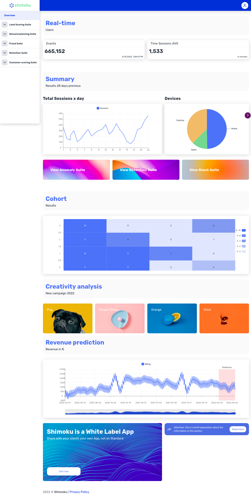

# Shimoku Api Python

Shimoku allows you to build Data Products in hours and create Predictive Analytics Products with Artificial Intelligence capabilities.

📊  [SDK](https://github.com/shimoku-tech/shimoku-api-python) |
📚 [Documentation](https://docs.shimoku.com/) |
🌐 [Website](https://www.shimoku.com/) |

Description
===========

You can create Data Apps such as the following with the templates you will find herein:

  

Note
====

This project has been set up using PyScaffold 3.2.3. For details and usage
information on PyScaffold see https://pyscaffold.org/.
