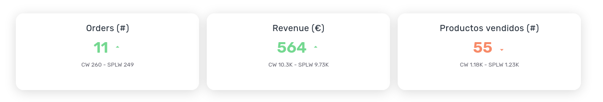
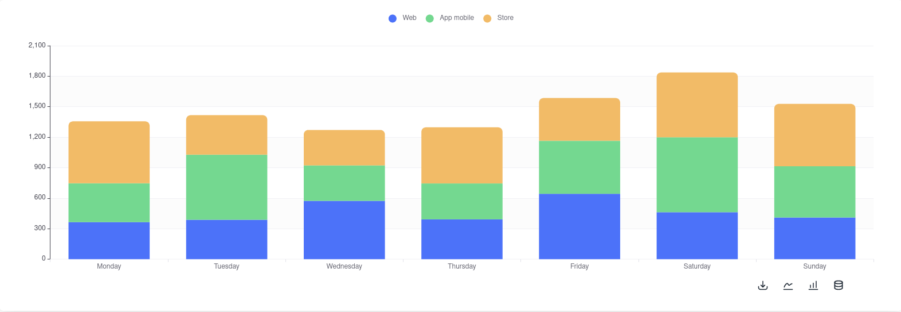
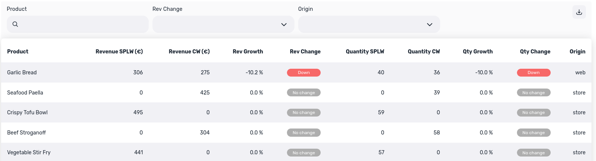
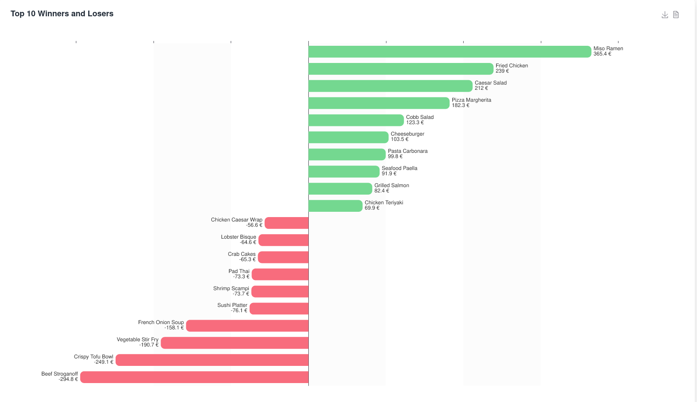

# Food Revenue dashboard

This dashboard serves as an example of what can be plotted with the Shimoku SDK, its based on the context of a food restaurant, which has an interest in on revenue

## List of charts

The dashboard uses a variety of charts and components that are builtin and one that is custom made: "The tornado chart"

- [Panel](https://docs.shimoku.com/development/charts/charts/html/panel)
    - Used as titles

  

- [Indicators](https://docs.shimoku.com/development/charts/charts/indicators)
    - Used for Key Performance indicators

  

- [Stacked Bar Chart](https://docs.shimoku.com/development/charts/charts/bar-charts/stacked-bar-chart)
    - To compare the proportion of revenue sources or "Origins"

  

- [Table](https://docs.shimoku.com/development/charts/charts/table)
    - See compare and query detailed information of revenue, quantiy. Filters by origin and product name

  

- "Tornado chart" with the help of [Free Echarts](Free Echarts)
    - See which products gained and lost more revenue compared to last week

  

