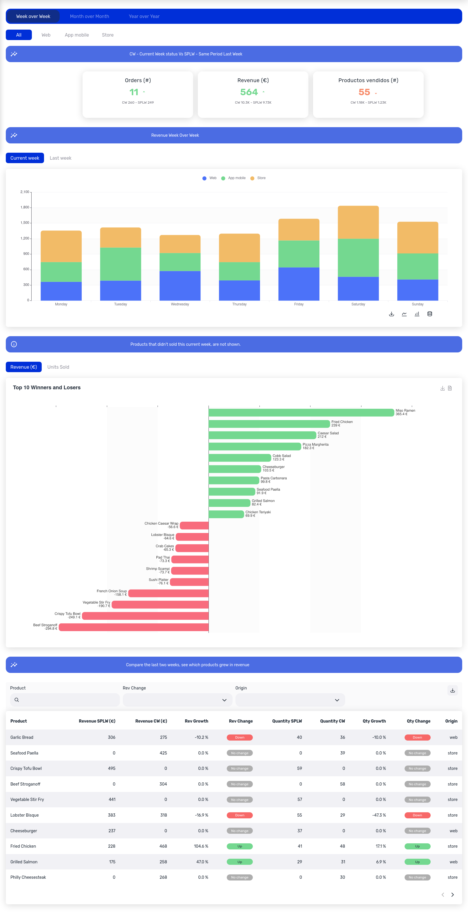

# Food Revenue dashboard

This dashboard serves as an example of what can be plotted with the Shimoku SDK, its based on the context of a restaurant, which has an interest on its generated revenue on the span of two weeks, the current week (cw) and last week (lw).

<p align="center">
  
</p>

## List of charts

The dashboard uses a variety of charts and components that are builtin and one that is custom made: "The tornado chart".

- [Panel](https://docs.shimoku.com/development/charts/charts/html/panel)
    - Used as titles

<p align="center">
  
</p>

- [Indicators](https://docs.shimoku.com/development/charts/charts/indicators)
    - Used for Key Performance indicators

<p align="center">
  
</p>

- [Stacked Bar Chart](https://docs.shimoku.com/development/charts/charts/bar-charts/stacked-bar-chart)
    - To compare the proportion of revenue sources or "Origins"

<p align="center">
  
</p>

- [Table](https://docs.shimoku.com/development/charts/charts/table)
    - To compare and query detailed information of revenue, quantiy. Filters by origin and product name

<p align="center">
  
</p>

- "Tornado chart" with the help of [Free Echarts](https://docs.shimoku.com/development/charts/features/free-echarts)
    - See which products gained and lost more revenue compared to last week

<p align="center">
  
</p>

## Generating data
The data was randomly generated using the `generate_dfs` function located in `utils.py`

If you want to generate new dataframes please import and run the function

```python
from utils import generate_dfs
# updates .csv files in data/ folder with new data
generate_dfs()
```
