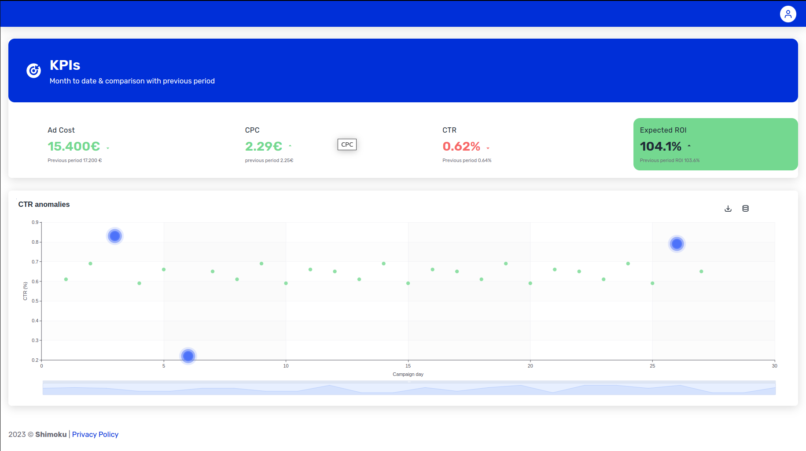
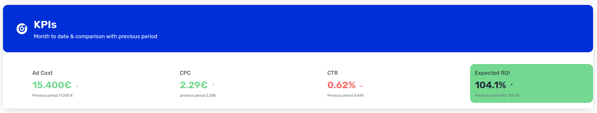
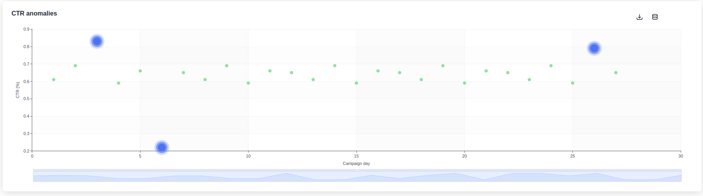

# Ads anomalies monitoring (v.0.18)

This dashboard serves as an example of what can be plotted with the Shimoku SDK, its based on the context of Ads monitoring.

<p align="center">
  
</p>

## List of charts

The dashboard uses 2 different charts introduced in version 0.18

- [Indicators with header](https://docs.shimoku.com/development/releases/2023/v.0.18)

<p align="center">
  
</p>

- [Scatter with effects](https://docs.shimoku.com/development/releases/2023/v.0.18)

<p align="center">
  
</p>


Finally, we also hided the left menu with a Theme trick that sets the menu to 0 pixels 

```python
    theme = {
        "custom": {
            "dimensions": {
                "drawerWidth": 0
            }
        }
    }
    s.business.update_business_theme(business_id=business_id, theme=theme)
```

