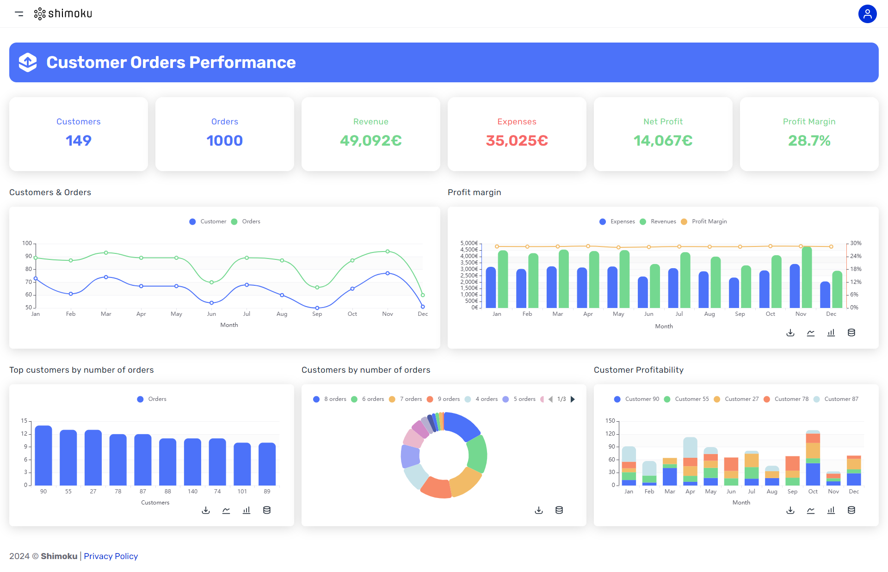

# Saas active users overview template

## Introduction

Welcome to our GitHub repository!
<br>
📊 Dive into user engagement analytics with us!
<br>
🚀 Explore metrics & insightful charts.
<br>
📈 See our dashboard [Customer Orders Performance](https://shimoku.io/46d100a4-ed9c-4783-9865-486ef3322bc4/customer-orders-performance?shared=true&token=13aa58cc-ab31-11ee-97ce-00155d148f4c)



## Getting Started

These instructions will get you a copy of the project up and running on your local machine for development and testing purposes.

## Prerequisites

Before you begin, ensure you have met the following requirements:

- Python 3.x installed on your system. You can download it from python.org.

- pip (Python Package Installer), should come installed with Python.

## Installation

Follow these steps to set up the project locally.

### Clone the repository:

```
git clone https://github.com/shimoku-tech/shimoku-app-templates.git
```
```
cd templates/customer_orders_performance
```

Create a virtual environment:

```
python3 -m venv venv
```

On Windows, you might need to use python instead of python3.

Activate the virtual environment:

On Linux/Mac:

```
source venv/bin/activate
```

On Windows:
```
 .\venv\Scripts\activate
```

Install the required packages:

```
pip install -r requirements.txt
```


## Configuring Environment Variables

The project requires certain environment variables to be set. These variables can be found in the .env.example file. To set them up:

Create a new file in the project root directory named .env.
Copy all content from .env.example to .env.

Replace the empty values with your specific configurations:
```
API_TOKEN=""
UNIVERSE_ID=""
WORKSPACE_ID=""
```


## Running the Application

Once the installation is done, and environment variables are set, you can run the application:

```
python3 main.py
```
