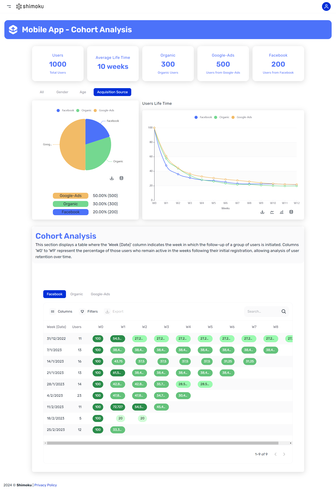

# Mobile App - Cohort Analysis template

## Introduction

Welcome to our GitHub repository!

📊 Dive into user activity analytics with us!

🚀 Explore metrics & insightful charts.

📈 See our dashboard: [Mobile App - Cohort Analysis Template](https://shimoku.io/0ba365c0-5097-430b-a3e9-9a4be5f2132d/cohort-analysis?shared=true&token=4a65d2fc-c511-11ee-88c0-00155d9e011f)



📅 Published on 2024-02-04 by [@jkahnc](https://www.github.com/jkahnc)

## Getting Started

These instructions will get you a copy of the project up and running on your local machine for development and testing purposes.

## Prerequisites

Before you begin, ensure you have met the following requirements:

- Python 3.x installed on your system. You can download it from python.org.

- pip (Python Package Installer), should come installed with Python.

## Installation

Follow these steps to set up the project locally.

### Clone the repository:

```
git clone https://github.com/shimoku-tech/shimoku-app-templates.git
```
```
cd templates/mobile_app_cohort_analysis
```

Create a virtual environment:

```
python3 -m venv venv
```

On Windows, you might need to use python instead of python3.

Activate the virtual environment:

On Linux/Mac:

```
source venv/bin/activate
```

On Windows:
```
 .\venv\Scripts\activate
```

Install the required packages:

```
pip install -r requirements.txt
```


## Configuring Environment Variables

The project requires certain environment variables to be set. These variables can be found in the .env.example file. To set them up:

Create a new file in the project root directory named .env.
Copy all content from .env.example to .env.

Replace the empty values with your specific configurations:
```
API_TOKEN=""
UNIVERSE_ID=""
WORKSPACE_ID=""
```


## Running the Application

Once the installation is done, and environment variables are set, you can run the application:

```
python3 main.py
```

## Generation of data

The data was randomly generated using the `generate_data` function located in `data/generate_mobile_app_cohort_analysis.py`

If you want to generate new dataframes please go to data folder, import and run the function

```python
from data.generate_mobile_app_cohort_analysis import generate_data
# updates .csv files in data/ folder with new data
generate_data()
```
