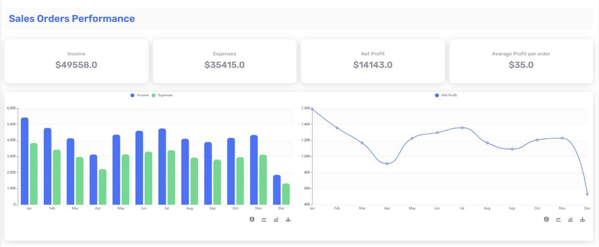

# Sales Order Performance Dashboard

This dashboard showcases the capabilities of the Shimoku SDK using the context of Sales Order Performance. The dataset revolves around sales orders, expenses, and the visualization of monthly income and expenses, along with the corresponding profits, over time. The analysis provides a comprehensive view of the financial performance on a month-to-month basis.

Experiencie our Dashboard: [Sales Order Performance Dashboard](https://shimoku.io/5169f788-389a-485e-a152-7284704ab28c/overview?shared=true&token=234a0835-c4f8-11ee-a60f-f4c88a8a3fad) 

📅 Published on 2024-02-06 by [@arturolinares24](https://www.github.com/arturolinares24)

## Getting Started

These instructions will get you a copy of the project up and running on your local machine for development and testing purposes.

## Prerequisites

Before you begin, ensure you have met the following requirements:

- Python 3.x installed on your system. You can download it from python.org.

- pip (Python Package Installer), should come installed with Python.

## Installation

Follow these steps to set up the project locally.

### Clone the repository:

```
git clone https://github.com/shimoku-tech/shimoku-app-templates.git
```

```
cd templates/sales_order_performance
```

Create a virtual environment:

```
python3 -m venv venv
```
  
On Windows, you might need to use python instead of python3.

Activate the virtual environment: 

On Linux/Mac:

```
source venv/bin/activate
```
  
On Windows:
```
 .\venv\Scripts\activate
```

Install the required packages:

```
pip install -r requirements.txt
```
  

## Configuring Environment Variables

The project requires certain environment variables to be set. These variables can be found in the .env.example file. To set them up:

Create a new file in the project root directory named .env.

Replace the empty values with your specific configurations:
```
API_TOKEN=""
UNIVERSE_ID=""
WORKSPACE_ID=""
```

## Generate example dataset

To generate the example dataset, execute the following command:

```
python3 generate_sales_orders_performance.py
```

## Running the Application

After completing the dataset generation and ensuring that the environment variables are correctly set, you can launch the application using the following command:

```
python3 app.py
```

## Screens

<p align="center">
  
</p>
