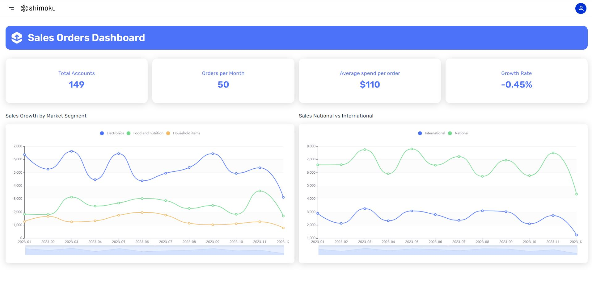

# Sales Orders Dashboard


The Sales Orders Dashboard, designed with the Shimoku SDK, provides a succinct overview of sales dynamics and customer purchasing behaviors. It aims to demonstrate the company's sales force efficiency, market penetration, and customer spending patterns. The main objective is to track the health of sales operations and identify trends or areas needing attention. By presenting data on the number of accounts, monthly orders, average spending, and growth rate, alongside segmented sales performance in the electronics, food and nutrition, and household items sectors, as well as a comparison between national and international sales, the dashboard delivers a strategic view into the business's performance and customer engagement across different markets and regions.

Experiencie our Dashboard: [Sales Orders Dashboard](https://shimoku.io/274b7154-05b1-49b5-87fa-1d52e84efff6/sales-orders-dashboard?shared=true&token=b324a48b-c4f1-11ee-97f3-f4c88a8a3fad) 

## Getting Started

These instructions will get you a copy of the project up and running on your local machine for development and testing purposes.

## Prerequisites

Before you begin, ensure you have met the following requirements:

- Python 3.x installed on your system. You can download it from python.org.

- pip (Python Package Installer), should come installed with Python.

## Installation

Follow these steps to set up the project locally.

### Clone the repository:

```
git clone https://github.com/shimoku-tech/shimoku-app-templates.git
```

```
cd templates/sales_orders_dashboard
```

Create a virtual environment:

```
python3 -m venv venv
```
  
On Windows, you might need to use python instead of python3.

Activate the virtual environment: 

On Linux/Mac:

```
source venv/bin/activate
```
  
On Windows:
```
 .\venv\Scripts\activate
```

Install the required packages:

```
pip install -r requirements.txt
```
  

## Configuring Environment Variables

The project requires certain environment variables to be set. These variables can be found in the .env.example file. To set them up:

Create a new file in the project root directory named .env.

Replace the empty values with your specific configurations:
```
API_TOKEN=""
UNIVERSE_ID=""
WORKSPACE_ID=""
```

## Generate example dataset

To generate the example dataset, execute the following command:

```
python3 data/generate_sales_orders.py
```

## Running the Application

After completing the dataset generation and ensuring that the environment variables are correctly set, you can launch the application using the following command:

```
python3 app.py
```

## Screens

<p align="center">
  
</p>
