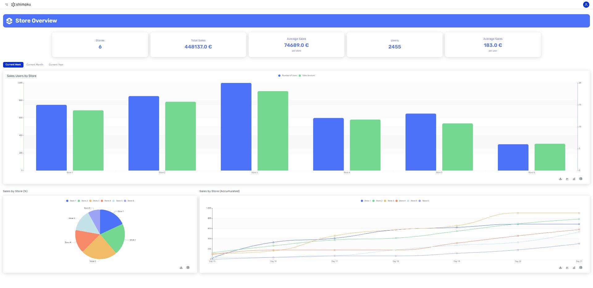

# Retail Store Overview


The Store Overview Dashboard, designed with the Shimoku SDK, provides a real-time, adaptable analysis of sales performance and customer engagement within a retail chain. It features interactive tabs that allow users to seamlessly switch views between weekly, monthly, and yearly sales data, affecting the display of three critical visual components: a bar chart of sales users by store, a pie chart breaking down sales percentages, and a line graph tracking accumulated sales. This functionality ensures a comprehensive understanding of the temporal sales trends, operational health, and customer activity across the stores. Aimed at optimizing sales strategies and identifying growth opportunities, the dashboard serves as a crucial tool for business leaders to monitor performance and make data-driven decisions.

Experiencie our Dashboard: [Retail Store Overview](https://shimoku.io/ca7a4445-5044-49b1-8eb4-1f58d0a41ccc/store-overview?shared=true&token=bdbf2e75-c511-11ee-9510-f4c88a8a3fad) 

## Getting Started

These instructions will get you a copy of the project up and running on your local machine for development and testing purposes.

## Prerequisites

Before you begin, ensure you have met the following requirements:

- Python 3.x installed on your system. You can download it from python.org.

- pip (Python Package Installer), should come installed with Python.

## Installation

Follow these steps to set up the project locally.

### Clone the repository:

```
git clone https://github.com/shimoku-tech/shimoku-app-templates.git
```

```
cd templates/store_overview
```

Create a virtual environment:

```
python3 -m venv venv
```
  
On Windows, you might need to use python instead of python3.

Activate the virtual environment: 

On Linux/Mac:

```
source venv/bin/activate
```
  
On Windows:
```
 .\venv\Scripts\activate
```

Install the required packages:

```
pip install -r requirements.txt
```
  

## Configuring Environment Variables

The project requires certain environment variables to be set. These variables can be found in the .env.example file. To set them up:

Create a new file in the project root directory named .env.

Replace the empty values with your specific configurations:
```
API_TOKEN=""
UNIVERSE_ID=""
WORKSPACE_ID=""
```

## Generate example dataset

To generate the example dataset, execute the following command:

```
python3 data/generate_retailer_sales.py
```

## Running the Application

After completing the dataset generation and ensuring that the environment variables are correctly set, you can launch the application using the following command:

```
python3 app.py
```

## Screens

<p align="center">
  
</p>
