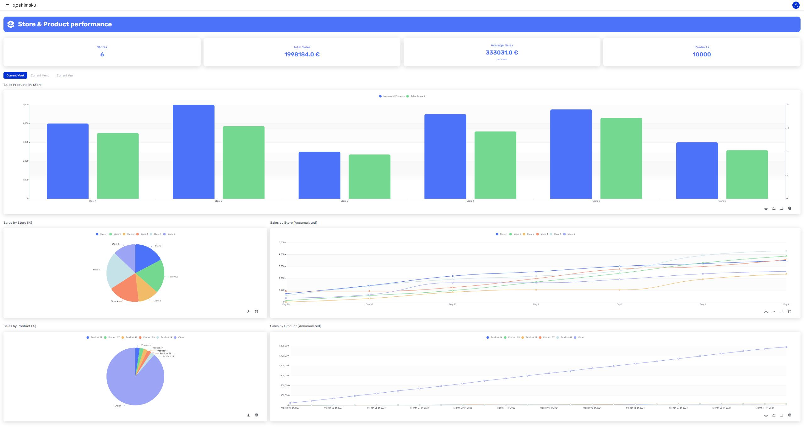

# Store Product Performance

The Store Product Performance Dashboard, crafted using the Shimoku SDK, offers dynamic and real-time insights into the sales achievements and customer interactions of a retail network. With intuitive interactive tabs, users can deftly navigate between weekly, monthly, and yearly data views, impacting the presentation of three essential visual components: a bar chart detailing sales by store, a pie chart illustrating the sales distribution, and a trend line graph that follows the cumulative sales over time. These elements are crucial in delivering a thorough understanding of sales patterns over time, the operational vitality of each store, and the behavior patterns of the clientele. Designed to enhance sales tactics and pinpoint areas for expansion, the dashboard is an indispensable instrument for corporate executives to track business metrics and craft strategies based on solid data analysis.

## Getting Started

These instructions will get you a copy of the project up and running on your local machine for development and testing purposes.

## Prerequisites

Before you begin, ensure you have met the following requirements:

- Python 3.x installed on your system. You can download it from python.org.

- pip (Python Package Installer), should come installed with Python.

## Installation

Follow these steps to set up the project locally.

### Clone the repository:

```
git clone https://github.com/shimoku-tech/shimoku-app-templates.git
```

```
cd templates/store_product_performance
```

Create a virtual environment:

```
python3 -m venv venv
```
  
On Windows, you might need to use python instead of python3.

Activate the virtual environment: 

On Linux/Mac:

```
source venv/bin/activate
```
  
On Windows:
```
 .\venv\Scripts\activate
```

Install the required packages:

```
pip install -r requirements.txt
```
  

## Configuring Environment Variables

The project requires certain environment variables to be set. These variables can be found in the .env.example file. To set them up:

Create a new file in the project root directory named .env.

Replace the empty values with your specific configurations:
```
API_TOKEN=""
UNIVERSE_ID=""
WORKSPACE_ID=""
```

## Generate example dataset

To generate the example dataset, execute the following command:

```
python3 data/generate_store_product.py
```

## Running the Application

After completing the dataset generation and ensuring that the environment variables are correctly set, you can launch the application using the following command:

```
python3 app.py
```

## Screens

<p align="center">
  
</p>
